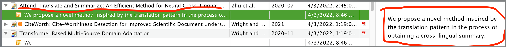

Read top 50 items from your zotero lib, generate summary for each, save as note.



# Prepare

## Install dependencies.

````bash
poetry install
poetry shell
``````


# Run

```
python main.py --model-name sobamchan/bart-large-scitldr --user-id zotero_user_id --zotero-key zotero_user_key
```

For other options for the model, see [here](https://github.com/sobamchan/schnitsum/).
